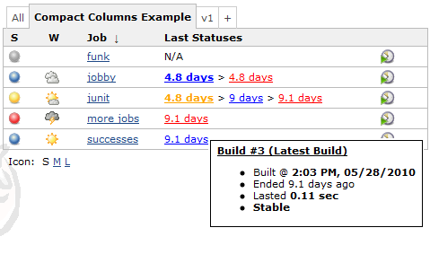

# Compact Columns Plugin

More compact columns for showing last success and failure.
Easier to understand, and takes less room in your view.

## What are the "Job Name" columns?

- **Job Name** -- Adds the job description as a tooltip
- **Job Name w/ Status Color** -- also Colors the job name according to the
  last build status

 

## What are the "Latest Statuses" columns?

These columns take the "Last Success" and "Last Failure" columns and combine
them into one easier to understand, and real-estate friendly column. You can
click on the status links to go to that build, and can hover over the link to
see additional information in the tool-tip.

### Some examples of the "Last Statuses" columns

Based on the configuration options you choose, you can get columns like these
examples.

## Why?

Even in this small screen-shot you can see how busy the "Last Success" and
"Last Failure" columns are. Quite frankly, it's hard to really get the
information you need "at a glance" like you should.

The problem is compounded if you have many jobs and scroll down and lose the
column headers. You can't remember which column is for which information.

This becomes even more useful when you are using some of the plugins that
provide additional columns (e.g. [Maven Info
Plugin](https://plugins.jenkins.io/maven-info/)) or alternate view layouts
(e.g. [Sectioned View Plugin](https://plugins.jenkins.io/sectioned-view/)).

## How do I use it?

Follow these steps

1. If the only view you have is the "All" view, and you want to edit that view
   see [Editing or Replacing the All View](docs/the-all-view.md). If you would
   like to add another view instead, do that.
2. Once you have a view you want to edit, see [Changing the Columns of a
   View](docs/changing-columns.md)
3. When changing columns, look for the "Compact Column" columns.  There
    are several columns to choose from:
    1. **Compact Column: Job Name w/ Options** -- Adds the job
        description, plus colors the job name according to the last
        status.  Also contains the following options
        1.  Color the Job Name according to the last build's status
        2.  Add the job's description to the tool-tip
        3.  Add the job's last status summary to the tool-tip - same
            look and feel as the status column tool-tips
        4.  Enable/disable colorblind support
    2. **Compact Column: All Statuses w/ Options** -- This column
        always shows you the last build for each of the statuses
        fail/stable/unstable. Also contains the following options
        1.  Show only the last status
        2.  Hide statuses that are older than a certain number of days
        3.  Enable/disable colorblind support
        4.  Choose either
            1.  Days ago - like "4 days" or "17 mins"
            2.  Date/time
    3.  **Compact Column: Unstable + Stable** -- This column prefers to
        show you just the latest un/stable builds, but will also show
        you if the last build failed
    4.  **Compact Column: Stable + Failed** -- This column prefers to
        show you just the latest stable/fail builds, but will also show
        you if the last build was unstable
    5.  **Compact Column: Job Name** -- Adds the job description as a
        tool tip.  (simpler version of Job Name w/ Options - kept only
        for backwards compatibility)

This screenshot shows what this configuration looks like. It is a little
different than most columns because you can configure the details per-view. For
example, you could have one view that shows the job name with color turned on,
and another view that has the color turned off.
 

## Contributing

If you want to contribute to this plugin, you probably will need a Jenkins
plugin developement environment. This basically means a current version of Java
(Java 8 should probably be okay for now) and [Apache Maven]. See the
[Jenkins Plugin Tutorial] for details.

If you have the proper environment, typing:

    $ mvn verify

should create a plugin as `target/*.hpi`, which you can install in your Jenkins
instance. Running

    $ mvn hpi:run -Djenkins.version=2.164.1

allows you to spin up a test Jenkins instance on [localhost] to test your
local changes before commiting.

[Apache Maven]: https://maven.apache.org/
[Jenkins Plugin Tutorial]: https://jenkins.io/doc/developer/tutorial/prepare/
[localhost]: http://localhost:8080/jenkins/

### Code Style

This plugin is using [Google Java Code Style], please try to adhere to that
style whenever adding new files or making changes to existing files. The style
is enforced using the [spotless] plugin, if the build fails because you were
using the "wrong" style, you can fix it by running:

    $ mvn spotless:apply

to reformat Java code in the proper style.

[Google Java Code Style]: https://google.github.io/styleguide/javaguide.html
[spotless]: https://github.com/diffplug/spotless

## Changelog

* See [GitHub Releases](https://github.com/jenkinsci/compact-columns-plugin/releases) for the recent versions
* See the [old changelog](docs/CHANGELOG.old.md) for versions 1.10 and older

