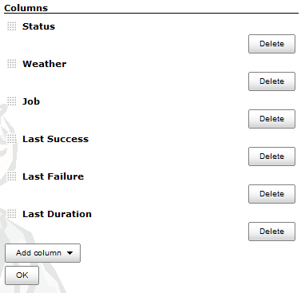

To change the columns of a view, follow these steps

1. If all you have is the "All" view, you will need to read the (short) article
   [Editing or Replacing the All View](the-all-view.md)
2. Once you have an editable view, this is very simple.
3. Click the  link. If you don't see this link, either
   you're not on a view page, or that view isn't editable. Views of type "All"
   are not editable. See [Editing or Replacing the All View](the-all-view.md).
4. Scroll to the bottom of the Edit View page, and the rest is obvious. Just
   delete the columns you don't want, add new columns you do want, and then
   grab and drag views to change their order.
   
